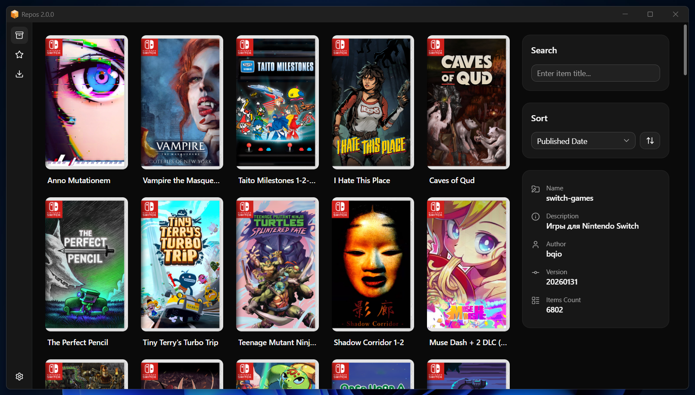

<div align="center">

<a href="https://repos.fun"></a>

# Repos [WIP]

**Repository manager for your purpose.**

<a href="https://github.com/bqio/repos/releases"></a>



</div>

## Recommended IDE Setup

- [VSCode](https://code.visualstudio.com/) + [ESLint](https://marketplace.visualstudio.com/items?itemName=dbaeumer.vscode-eslint) + [Prettier](https://marketplace.visualstudio.com/items?itemName=esbenp.prettier-vscode)

## Project Setup

### Install

```bash
$ npm install
```

### Development

```bash
$ npm run dev
```

### Build

```bash
# For windows
$ npm run build:win

# For macOS
$ npm run build:mac

# For Linux
$ npm run build:linux
```

### Publish

```bash
$ git add .
$ git commit -m 'message'
$ git push
$ npm version patch
$ git push --tags
```
